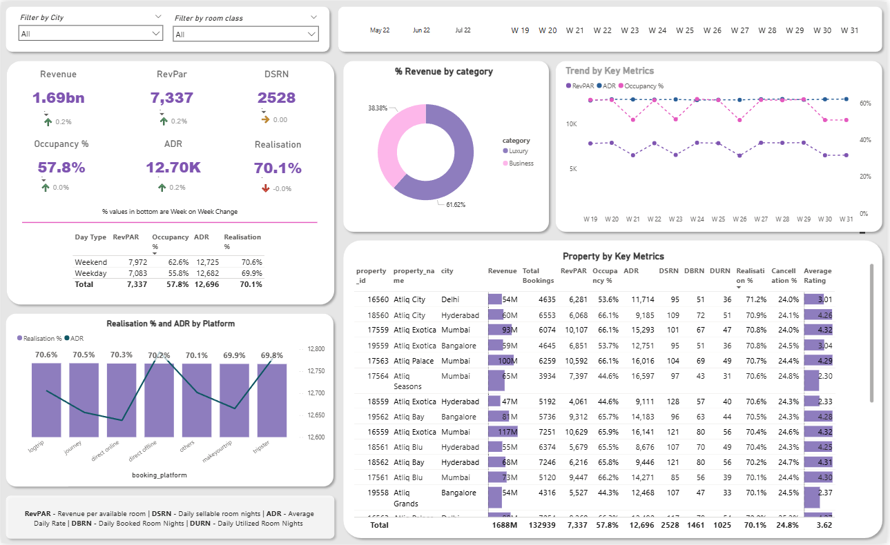

# 🏥 Hospital Performance Dashboard (Power BI)

## Project Overview

This project features a comprehensive and interactive **Hospital Performance Dashboard** built using **Microsoft Power BI**. The primary objective is to transform complex raw data into clear, actionable insights for hospital administrators, department heads, and operational staff.

By providing a single source of truth for key performance indicators (KPIs), this dashboard enables **data-driven decision-making** to improve patient care, optimize resource utilization, and enhance overall operational and financial efficiency.

---

## Key Features & Metrics

The dashboard visualizations are divided into several key focus areas to provide a holistic view of hospital health:

### 1. Operational Efficiency
| Metric | Description |
| :--- | :--- |
| **Length of Stay (LOS)** | Tracks the average number of days patients spend in the hospital, broken down by department and condition. |
| **Bed Occupancy Rate** | Monitors the utilization of hospital beds to manage capacity and anticipate bottlenecks. |
| **Patient Wait Times** | Measures the average time from patient arrival to initial treatment in critical areas like the Emergency Room (ER). |

### 2. Clinical Quality & Safety
| Metric | Description |
| :--- | :--- |
| **30-Day Readmission Rate** | Key indicator of care quality; tracks the percentage of patients readmitted within 30 days of discharge. |
| **Infection Rates** | Monitors Hospital-Acquired Infections (HAIs) by facility and unit to guide safety protocols. |
| **Patient Satisfaction** | Visualizes aggregated patient survey scores (e.g., HCAHPS) to gauge patient experience. |

### 3. Financial Performance
| Metric | Description |
| :--- | :--- |
| **Revenue vs. Budget** | Compares actual monthly and quarterly revenue against established financial targets. |
| **Cost Per Case (CPC)** | Provides a granular view of costs associated with specific diagnosis-related groups (DRGs). |

---

## Technical Stack & Repository Structure

* **Primary Tool:** Microsoft Power BI Desktop (`.pbix`)
* **Data Modeling:** Utilizes Star Schema principles with calculated measures written in **DAX**.

| File/Folder | Type | Description |
| :--- | :--- | :--- |
| `Hospital_Performance_Dashboard.pbix` | Power BI File | The main dashboard file containing the data model, all reports, and visualizations. |
| `Data Folder/` | Data Source | This folder holds the raw data files (e.g., CSV, XLSX) used to source the Power BI model. |
| `dashboard_preview.png` | Image | A static snapshot of the dashboard's main view for a quick, non-interactive preview. |

---

## 🚀 Getting Started

To view and interact with the full dashboard, you must have **Microsoft Power BI Desktop** installed on your machine.

1.  **Clone the Repository:**
    ```bash
    git clone [https://github.com/Aditya11o/hospital-performance-dashboard.git](https://github.com/Aditya11o/hospital-performance-dashboard.git)
    cd hospital-performance-dashboard
    ```

2.  **Install Power BI Desktop:**
    Download and install the latest version from the official Microsoft Power BI website.

3.  **Open the Dashboard:**
    Double-click the `Hospital_Performance_Dashboard.pbix` file.

4.  **Data Source Refresh (If needed):**
    If the dashboard prompts you about missing data sources, you may need to update the file paths:
    * In Power BI Desktop, go to **Home tab > Transform data > Data source settings**.
    * Select the old source path and click **Change Source...** to point it to the local `Data Folder` within your cloned repository. This will refresh the model with the local data.

---

## Preview

A visual snapshot of the main dashboard page:


